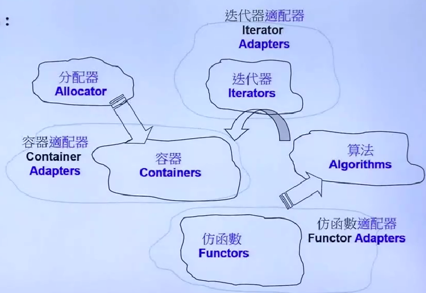
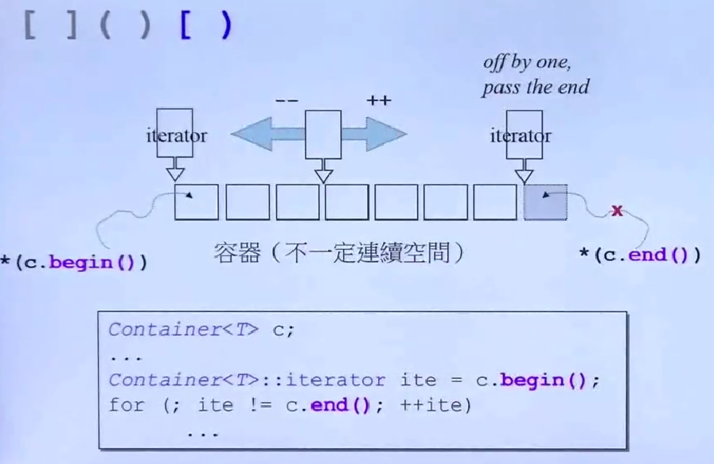

# C++STL标准库和泛型编程——体系结构与内核分析  

## 认识headers 版本 重要资源  

所谓generic programming（**GP，泛型编程**），就是使用template为主要工具来编写程序，而**STL**就是**正是泛型编程最成功的作品**  

STL早期主要是用模版做出来的，没有太多的继承  

目标：使用->认识->良好使用->扩充  

### C++ Standard Library vs Standard Template Library  

标准库大于STL  

手上有编译器，里面就一定带着标准库，以头文件形式呈现,  
C++标准库和新式C header files不带副档名.h，例如
```cpp
#include <vector>
#include <cstdio>
```
旧式C header files（带副档名.h）仍然可用，例如`<stdio.h>`  

新式headers内的组件都被封装在namespace "std"
```cpp
using namespace std;
using std::cout;
// 旧式headers的组件不封装于std  
```  

### 版本  

不管用哪个IDE哪个编译器，这些标准库的内容都是一样的

### 重要资源  
<https://cplusplus.com/>  
<https://cppreference.com/>  
<https://gcc.gnu.org/>  


## STL体系结构基础介绍  
**STL六大部件**：  
容器(Containers)、分配器(Allocators)、算法(Algorithms)、迭代器(Iterators)、适配器(Adapters)、仿函数(Functors)  

  

和OO把数据和函数放一起不同，GP把容器和算法分开，用迭代器作为桥梁，迭代器就像一种泛化的指针  

Adapters会对容器迭代器和仿函数做转换  

**前闭后开区间**  

标准库容器的begin()指向容器的第一个元素，end()指向元素的最后一个元素的下一个位置



## 容器分类与测试  
对于排序  
**Sequence Containers**  
Array, Vector, Deque, List, Forward-List  

对于需要大量查找  
**Associative Containers**  
Set/Multiset  
Map/Multimap  
标准库里头，这俩内部是红黑树做的  
有Multi的区别是key可以重复  


