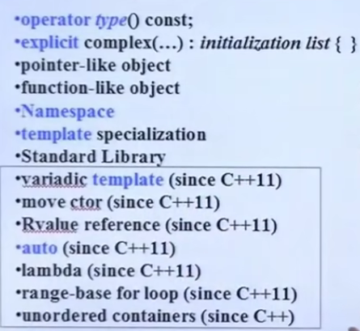
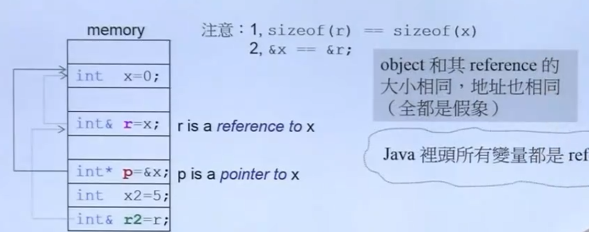
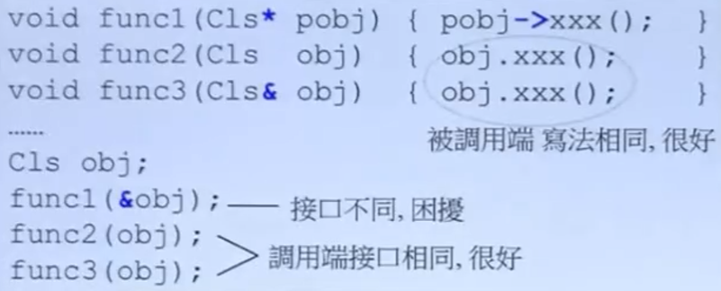
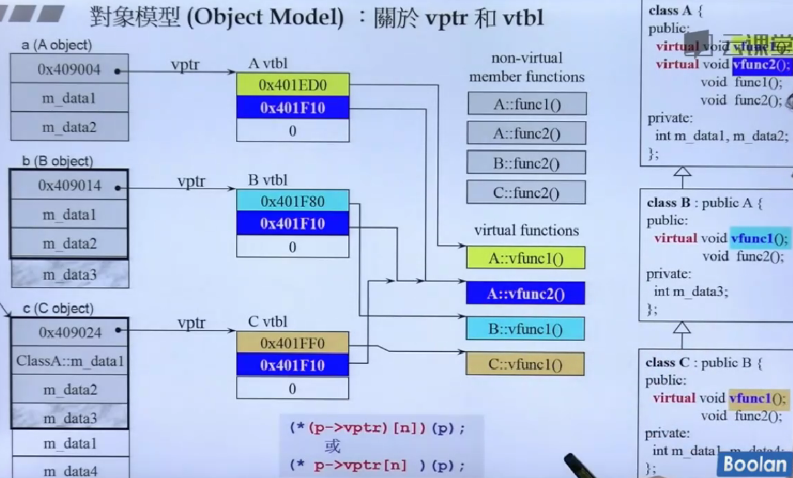

## C++程序设计（II）兼谈对象模型  
包含模版 泛型 不单单是oop，所以相比于上去掉了面向对象，谈上面没有讨论的主题,在之前正规大气的编程素养上讨论更多细节，探讨另一个cpp技术主线，泛型编程，和更多深入底层的内容。vptr、vtbl、virtual mechanism等  

  

### conversion function,转换函数  

**函数类型能不能相互转换**  

例子：自己写的class分数fraction，分子除以分母就是一个double，通过转换函数转为double，这样编译器看到fraction对象的时候如果需要double就会自己调用double()转换函数将其转换为double的type  
```cpp
class Fraction
{
public:
    Fraction(int num, int den =1)
    : m_numerator(num), m_denominator(den){}
    operator double() const { //conversion function
        return (double)(m_numerator) / m_denominator; // 将结果转换为double类型 这里是(double)(m_numerator) / m_denominator，而不是(double)(m_numerator / m_denominator)，因为整形相除的结果是0，转换为double还是0
    }
private:
    int m_numerator;
    int m_denominator;
};

int main(){
    Fraction f(3,5);
    double d = 4+f  //这时编译器会调用operator double()将f转为0.6
}
```

什么是转换函数（Conversion Function）？  
这个语法的精髓在于：它**没有返回类型**，因为它的**名字本身就是返回类型**。

**格式**：`operator TargetType() const { ... }`

**特点**：  

- **没有参数**：它是为了**把“自己”变出去**。  

- **通常带 const**：转换通常不应该改变对象自身的状态。  

- **隐式调用**：编译器在看到 4 + f 时，发现 4 是 int，而 f 是 Fraction。它会满大街找：“谁能把 Fraction 变成数字？” 此时你的 operator double() 就像救星一样站了出来。  

### non-explicit-one-argument ctor，把别的东西变成自己这种东西  

one argument意思是只要一个实参就够了  

如果没有声明explicit，又对+进行了操作符重载，在进行Fraction d =f+4时编译器会寻找合理的方法让这条语句能通过，这时会把4转化为Fraction这种类型。  

这时如果又加上前面的转换函数，编译器有两种选择，就会报错。  

使用explicit，就不允许4转换为Fraction了  

## point-like classes
### 关于智能指针    
`point like`:指针所能做出的行为这个class也要都允许  

所以要对`*`和`->`进行操作符重载  

而这两种操作符重载的写法一定是下面这样的，以`shared_ptr`为例：  
```cpp
template<class T>
class shared_ptr{
public:
    T& operator*() const { return *px; }  //解引用操作符重载，返回指针所指向的对象的引用
    T* operator->() const { return px; }  //成员访问操作符重载，返回指针本身,->在cpp里是特殊的，一个东西使用了->还会接着->，这是cpp的特性
    }
    shared_ptr(T* p): px(p) {}

private:
    T* px;
    long* pn;
...
```
在cpp里，解引用操作是写死的，所以编译器只会对`*ptr`有反应  

然后cpp内置编译器的`->`是迭代的，如果访问的成员还是一个指针，则会递归的调用`->`直至其不是一个指针  

### 关于迭代器  
也是一种智能指针，但还要去重载`++`和`--`  

以链表的迭代器为例，主要看*和->的重构  
```cpp
template<T>
struct __list_node{ //链表节点的声明
    void* prev;
    void* next;
    T data;
};
template<class T, class Ref, class Ptr>
struct __list_iterator{
    typedef __list_iterator<T, Ref, Ptr> self;
    typedef Ref reference;
    typedef Ptr pointer;
    typedef __list_node<T>* link_type;
    link_type node;
    bool operator==(const self& x) const { return node == x.node; }
    bool operator!=(const self& x) const { return node != x.node; }
    reference operator*() const { return (*node).data; }
    pointer operator->() const { return &(operator*()); } // 理解这一点得明确迭代器的职责，迭代器是数据对象的指针，要通过迭代器来通过->调用数据对象的method，就必须让->最终返回的是一个有method的类型的地址，这样编译器才能通过->来调用数据对象的method，如果只返回容器的地址，那么没有method，迭代器也做不到他的职责
    // 这里还用到了复用，将重载好的解引用直接拿来用，很优雅 
    // 本来是要取节点数据(*node).data的地址，节点数据由this->operator*()返回，在类里面成员函数的this可以省略，所以简化为operator*()，再取个地址就完成了
    // 前置++，先加后用，先node指向下一个，然后返回本身，没有产生local的结果，所以加引用，数据成员改变不加const
    self& operator++() { node = (link_type)(node->next); return (*this); } //(link_type)强制void*类型转换为__list_node<T>*
    // 后置++，先用后加，返回的是之前的副本
    self operator++(int) { self tmp = (*this); ++*this; return tmp;} //代码复用
    self& operator--(){ node = (link_type)(node->prev); return (*this); }
    self operator--(int){ self tmp = (*this); --*this; return tmp;}
};
```

## function-like classes，所谓仿函数  

**像函数**：**能用小括号`()`**，所做出来的对象可以接受小括号，关键在于对operator()

标准库里的仿函数都会对()做操作符重载，他们都会继承一些很奇特的base class(std::unary_function和std::binary_function)，里面什么都没有，理论size是0，实际上是1，因为，只有一些typedef(老师说之后标准库再讲)  

继承这些空的base class是因为这些东西是给**适配器adapter**看的，cpp的模版在编译期实例化，这时候通过基类知道他们的类型信息，从而自动推导出类型。  

size是1是因为在cpp里**任何对象**哪怕是空对象的大小都**至少为1字节**，因为计算机要保证不同对象有不同的内存地址，如果创建两个空对象大小为0，那么他们的地址就一样了，地址一样则这两个对象就不能进行区分，所以要保证**物理地址的唯一性**。如果对象大小为0，指针运算也会崩溃    

继承这些基类**不会导致**仿函数的大小膨胀，因为编译器看到基类是空的会让派生类（仿函数）的起始地址和空基类的**起始地址重合**。  

题外话：**现代**cpp已经弃用了这两个基类，因为有了更强大的工具，不需要显式继承也可以推导出类型。

## namespace经验谈  

侯老师提到在测试时，如果不想创建多个文件，可以在一个文件里用多个`namespace`包住不同的单元，这样可以避免创建多个文件的复杂性，同时也方便命名，不同的`namespace`即使重名也不会互相干扰  

`namespace`的物理本质：  
`namespace`不会改变内存，但编译器会对`namespace`里的函数名加上**名字修饰**，通过这种方式在**链接**阶段把不同`namespace`里的同名`function`区分开  

在`namespace`嵌套或者用了`using namespace`时，编译器找变量时会**从当前作用域local开始一层层往外global找**  

## class template  
同（上）  

## function template  
函数模版在使用时不需要指明T，因为编译器会对函数模版做实参推导

## member template，成员模版  

成员模版是为了**模拟Up-cast**，即模拟子类指针转换成父类指针的操作，**语法本质**是class Template里对成员函数做一个function template

具体解释：  

在cpp里，子类指针可以赋值给父类指针，如
```cpp
class Base{};
class Derived : public Base{};
Base *p = new Derived; // 子类指针可以传递给父类
```
而在template里，`Ptr<Bird>` 和 `Ptr<Animal>` 是两个完全无关的类，成员函数的作用是告诉编译器：“只要 `U*` 能赋值给`T*`（即子类转父类），那么 `Ptr<U>` 就可以赋值给 `Ptr<T>`  

且只能用于子类转父类，不能用于父类转子类，这种约束是通过初始化列表的指针赋值，即cpp自身的原生语法实现的  

以智能指针shared_ptr为例： 
```cpp
template<class _Tp>
class shared_ptr : public __shared_ptr< _Tp>
{
...
    template<class _Tp1>
    explicit shared_ptr(_Tp1* __p)
    :__shared_ptr<_Tp>(__p){} 
// 这个成员模板处理的是‘原生指针’到‘智能指针’的 Up-cast 转换；除此之外，成员模板还可以用于‘智能指针’到‘智能指针’的拷贝构造转换。
    template<class _Tp1>
    shared_ptr(const shared_ptr<_Tp1>& r)
    :px(r.px){}
...
};

Base1* ptr = new Derived1; //up-cast
shared_ptr<Base1> sptr(new Derived1); // 模拟up-cast
```

## specialization, 模版特化  

由于泛化版本的逻辑可能对有些类型会有**不适应**或者**不够快**，为了解决问题或者提高效率，设计者对某些独特的类型要做特殊的处理  

在底层，编译器会用**查表机制**，先去特化清单里搜索是否存在特化模版，如果搜到了，会丢弃泛化模版转而用特化代码生成机器码。  
**代码隔离**：特化版本和偏特化版本在最终的二进制文件中是互不干涉的两段代码。

例子：
```cpp
template<class Key>
class hash {}; // 这个叫泛化

// 这些叫特化
template<> // 这是全特化的标志，不能省略
class hash<char> {
    size_t operator()(char x) const { return x; }
};
template<>
class hash<int> {
    size_t operator()(int x) const { return x; }
};
```  
**两个场景：**  

**跑不通**：泛化版可能对`int`和`double`能处理，但是对于`char*`类型无法处理，这时就必须为`char*`类型写一个特化版本  

**不够快**:泛化版可能有一套复杂通用算法，但对某些类型不需要用到，这是可以对具体类型用特化版提高效率。比如遍历对象的每一个字节进行哈希计算，但对于 int，最好的哈希值就是它本身，这时可以给 int 开小灶，跳过昂贵的通用哈希算法，直接 O(1) 返回。在大数据量下，会有几十倍的性能提升。

## partial specialization，模版偏特化  

**个数上的偏和范围上的偏**  

### 个数的偏  

一个模版有两个/多个模版参数，想绑定其中一个，但最好从左往右绑定不要跳跃，   
其实只要没有歧义都是可以的，但是容易有歧义，所以工程上不建议这样做，比如有5个class，锁定135容易有歧义 

例子：  
```cpp
template<class T, class Alloc=...>
class vector{
...
};

template<class Alloc> // 这里对绑定的class不用在写出来，但没绑定的还是要写，且这里的Alloc后面不能接默认类型，否则会报错 
class vector<bool, Alloc> // 这里要把要对偏特化的typename写出来  
{
...
};
```

### 范围的偏  

从任意类型缩小为**指针**，  
指针也是一种类型，对任意类型可以缩小为对指针类型做偏特化  

不只是指针，范围偏特化是**模式匹配**，还有常量偏特化，数组偏特化，引用偏特化，向量偏特化

一个典型应用是用指针类型的偏特化来解包  

```cpp
template<class T> // 定义一个模版接受T类型
class C        // 此时传入int*，指针是一个类型，此时T为int*
{
    ...
};

template<class T>// T从任意类型偏特化为指针，编译器说如果是指针就用这一套代码
class C<T*>    // 传入int*，这时的T是int！而不是说T是int*，下面更不是int**
{
    ...
};

// 也可以这样写，不容易混淆
template<class U>
class C<U*>
{
    ...
};
```

几个注意的点，  
1. 泛化版本**必须存在**才能写偏特化版本，只有偏特化版本编译器根本不知道你这class是什么，如果想只支持偏特化版本可以写一个空壳的泛化版本      
2. 编译器处理模版特化的底层逻辑是**模式匹配优先于名字定义**，在这种偏特化的版本他是倒着推的，而不是看到`template<class T>`就直接匹配，而是先试着匹配偏特化版本，比如`T*`匹配上`int*`上后，才把前面的`T`定义为`int`

## template template parameter，模版模版参数  

**模版的参数是模版？**  

例子

```cpp
template<typename T,
        template<typename T>
        class Container
        >    // 模版参数是一个模版，但要注意第二个T是形参，和第一个T不是同一个东西，换成U也是一样的
class XCLs
{
private:
    Container<T> c;
public:
    ...
};

template<typename T>
using Lst = list<T, allocator<T>>

int main()
{
    XCLs<string, list> mylst1; // 报错，因为list模版虽然第二个参数有默认参数，但是编译器认为这是一个有两个模版参数的模版，所以接口不匹配，所以需要用Lst转换成一个只有一个模版参数的模版
    XCls<string, Lst>  mylst2;
}
```

```cpp
//第二个参数
template<typename T>
class Container
```
```cpp
// list长这样,要变成只有一个模版参数的模版编译器才认
// 这俩T是同一个，后者是前者的引用，和前面嵌套的逻辑不同  
template<typename T, typename Alloc=std::allocator<T>>
class list
{
    ...
};
```
模板头（Template Header）是符号的‘立项声明’，它先在当前的编译上下文中强行‘无中生有’出一个符号 T，后续的参数才能将这个 T 视为已存在的类型进行‘消费’。

## 关于C++标准库  

标准库里有很多好用的数据结构 算法 仿函数 迭代器 很重要  


## 三个主题  

### variadic templates(since C++ 11)模版参数可变化  

允许你写任意个参数，怎么写呢,`typename...`  
模版、函数的参数，都可以用这个  

比如你不知道要传进去多少个参数，但又希望可以处理任意数量的参数  

example:  

```cpp
void print(){} // 在传进参数个数为0个的时候不做任何事，递归的终点，这个必须存在  

template<typename T, typename... Types> //这是一个模版函数 
void print(const T& firstArg, const Types&... args)
{
    // 打印第一个然后递归调用自身直至打印完所有参数
    cout << firstArg << endl;
    print(args...); // 这里用到函数参数包展开
}
// 这样一来，任意类型任意数量的函数都可以了

// 用法  模版函数直接使用，编译器会隐式转换
print(7.5, "hello", bitset<16>(377), 42)

// C++ 规定：
// 定义时：... 放在类型和名字之间，表示“这是一个包”。
// 调用时：... 放在名字后面，表示“把这个包拆了”。
```

`...`就是一个所谓的包pack

用于函数模版就是函数模版包，  
用于函数参数类型就是函数参数类型包，  
用于函数参数就是函数参数包  

如果想知道后面的包有多少个，可以用  
`sizeof...(args)`


### auto  

一个语法糖  

```cpp
list<string> c;
...
list<string>::iterator ite;
ite = find(c.begin(), c.end(), target);
```
cpp11
```cpp
list<string> c;
...
auto ite = find(c.begin(), c.end(), target); // 用返回值自己推ite的类型
// 不能这样用
// auto ite;
// ite = find...
```

### ranged-base for  
遍历容器里的单元，传统是for each或者从迭代器里取  

```cpp
for ( decl : coll) {
    statement
}
```

example:
```cpp 
for ( int i : { 2, 3, 4, 5}){
    cout << i << endl;
}
```

搭配容器：  
```cpp 
vector<double> vec;
...
for (auto elem : vec) {    // pass by value，操作不会影响原来的东西
    cout << elem << endl;
}

for (auto& elem : vec) {    // pass by reference
    elem *= 3
}
```

## reference  
“reference是一种漂亮的pointer”  
{width=600}  

object和其引用的大小和地址相同，这是编译器给你的假象  

**常见用途：**  
{width=500}  
  
`reference`通常不用于声明变量而是用于**参数类型**(`parameters type`)和**返回类型**(`return type`)的描述  

以下二者不能并存，因为被视为“**same signature**”：  
```cpp
double imag(const double& im) {...}
double imag(const double  im) {...}// Ambiguity模棱两可
// 其中imag(const double& im)这部分叫函数签名，如果后面有const也算函数签名的一部分，也就是说两个一样的函数一个后面有const一个没有是可以并存的
```

## 对象模型(Object Model):
### 关于虚指针vptr和虚表vtbl  

只要你的类里有虚函数，不管是一个还是一万个，内存里就会多一根指针vptr，指向一个虚表vtbl，里面存放虚函数的指针，指向虚函数所在的位置  

**vptr的位置**：  

几乎所有主流编译器（VC++, GCC, Clang）都会把 vptr 放在对象内存布局的最开头。保证即便指针向上转型，p->vptr 的偏移量永远是 0。  

继承子类会有父类的part，继承时不止继承数据还有函数，函数继承的不是内存大小而是**调用权**，  

**静态绑定**：编译成call xxx，固定地址  

**虚机制**virtual mechanism:  
**动态绑定**：通过指针找到vptr找到vtbl再找到要调用的虚函数，  

动态绑定**三个条件**：通过**指针**调用，指针**向上转型**up-cast，调用的是**虚函数** 

一般指向子类的就是up-cast  
比如一个函数要的是父类，你给的是子类，子类是父类，但是要的是父类，所以会把子类转成父类，即父类指针指向子类  

**vtbl构造顺序**：
子类**重写**：在虚表覆盖相同位置的函数地址
子类**新增**虚函数：排在父类虚函数后面

如果用c的语法写出来长这样  
```c
(*(p->vptr)[n])(p);
// 或者
(* p->vptr[n])(p);
// n是编译器当时看你写虚函数的顺序是第几个
//这里多出来的那个 (p) 参数其实就是 this 指针。因为虚函数本质上还是类成员函数，调用时必须知道是哪个对象在调用。
```  

一种用法:多态polymorphism  
假设要用一个容器list装不同形状的shape，这里面可能涉及到多个继承，比如圆形是一种椭圆，椭圆是一种shape，正方形是一种矩形，矩形是一种shape，他们的类型不一样，成员就不一样，那么大小也就不一样，既然容器的大小不一样，所以需要用指针来装这些形状，指向不同的形状
```cpp
list<A*> mylst;
```
**虚析构函数**：
这里要注意，如果一个类里有虚函数或者这个类会被继承，那么需要把析构函数也设为virtual，它也会进虚表。因为如果不这样子类delete的时候只会调用父类A的析构函数，而子类特有的成员就不会被释放导致内存泄漏。  

**性能代价**：  
**空间**代价：每个对象多一个ptr的大小
**时间**代价：  
- **查表延迟**：多两次指针跳转。
- **流水线断裂**：现代CPU喜欢预测下一行指令，动态绑定会让CPU难以预测跳转，导致指令缓存命中率下降。  

### 关于this ptr  
侯捷老师讲了虚函数和模版方法，和上的内容类似，其中强调了this指针在有了虚指针和虚表之后的解释，  
```c
(*(this->vptr)[n])(this) // Dynamic binding
```  

## const  
**常量成员函数**(const member functions)  

成员函数后面加`const`，表示保证不会改变data members，不加就是说我可能会改，不保证data members不变  

编译器是不讲情面的，它只看你的**承诺(函数签名)**，而不看你的“实际行动（函数体代码）”  

可变对象可以用常量成员函数也可以用非常量成员函数，但是**常量对象**只能用常量成员函数，**不能用非常量成员函数**，哪怕这个非常量成员函数确实没改数据  

对于[ ]的重载，往往要写const和non-const的两个版本的重载，为了应对const object和non-const object的不同情况。  

在这两个版本同时存在的时候，**non-const object只能使用non-const版本的重载**。  

比如std:string里，[]的重载  
对const版本不需要实现**copy on write**（写时复制，省去拷贝开销）
对non-const版本则要实现COW（说的是老版本的C++，新版本直接拷贝或者使用移动语义）

**底层真相**：  
const 重载本质上是**对隐藏的 this 指针的重载**。  

非常量版本里，this 的类型是 T* const。  

常量版本里，this 的类型是 const T* const。 编译器正是通过辨别 this 指针是否带 const 属性，来决定调用哪个版本的  

## new,delete  
补充：  
你的class其实可以重载operator new和operator delete来做一些内存池的设计  

## operator new, operator delete    
为什么要重载 operator new？  
**减小开销**：避开 malloc 为每个对象添加的 Cookie（保存内存大小信息的额外空间），节省内存。  

**提升速度**：利用 内存池 (Memory Pool)，一次性申请一大块内存，后续分配只需移动指针，比通用的 malloc 快得多。   

`::operator new` (全局版本)：  
**作用**：接管整个程序所有的内存分配。  
**评价**：除非你在写操作系统或极特殊的嵌入式方案，否则**千万别动**它，动了它全世界都跟着乱。  

class 专属的 `operator new`：  
**作用**：当你 new 这个特定类的对象时，不用系统的 malloc，用你自己写的逻辑。  
**评价**：这就是内存池的入口。你可以自己管这一块内存。

**placement new** (带额外参数的operator new**重载**版本就叫placement new，可以全局或在类内部)：  

**作用**：你在 new 的时候想多传几个参数，比如 `Foo* p = new(my_pool) Foo();`。  
**评价**：这通常是为了配合特定的分配逻辑。

operator new 的**重载规则**
**第一个参数：必须是 size_t**（由编译器自动计算对象大小并传入）。

可以有多个版本：只要**参数列表不同**（这叫 placement new）。

```cpp
void* operator new(size_t size, MemoryPool& pool); // 额外带一个池子参数
```

**operator delete**  
**正常删除**：delete p; 永远只调用那个最普通的 operator delete(void*)。  
**异常回滚**：只有当 new 申请完内存，但在调用 构造函数抛出异常 时，系统才会寻找与该 new 参数完全匹配的 operator delete 来清理现场。  
```cpp
void* operator new(size_t, void*, int);     // 你定义的版本
void  operator delete(void*, void*, int);   // 对应的“异常保险”版本
```
如果不实现会怎样？

不会报错：编译器**不会强制**你实现。  

**后果**：如果真的发生了构造函数异常，系统找不到对应的 delete，那块刚申请的**内存就泄露**了。  

**结论**：这是一种“保险”，为了程序的健壮性，重载了带参数的 new，通常最好也写上对应的 delete。  

解释：  
对operator new的**带参重载**就叫做placement new，意即在特定的位置，默认new使用malloc在堆上分配内存，然后构造，placement new不分配内存，而是在特定的地方使用内存。  

有了带参重载的operator new就可以使用`new(分配器参数) classname(构造函数参数)`语法，第一步会使用operator new，一般这个函数会**返回一个内存指针地址**，然后第二步就会在这个指针地址上调用构造函数初始化对象。  

**销毁警告**： 用 Placement new 构造的对象，**绝对不能**用 delete p;。因为内存不是 operator new 分配的，直接 delete 会导致崩溃  
**正确做法**：显式调用析构函数 p->~Foo();。如果内存是自己申请的，手动处理内存释放；如果是栈内存，则无需处理内存释放。  

标准库最简单的重载版本  
```cpp
void* operator new(size_t size, void* ptr){
    return ptr; //只是传回原来的地址
} //“哪怕你写的是 new(ptr) Foo，编译器传给 operator new 的第一个参数依然是 sizeof(Foo)，只是在那个最简版本的实现里，我们把这个 size 忽略了，直接返回了 ptr。”
```

比如标准库basic_string使用new(extra)来扩充申请量  


