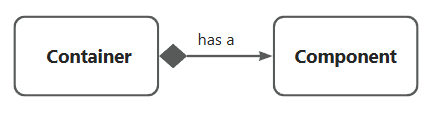
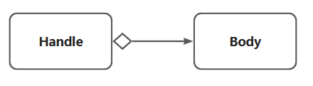
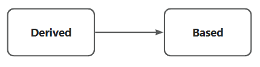
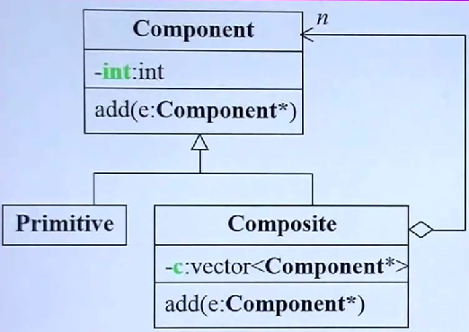

本笔记是基于侯捷的cpp视频 由于已经学过cpp 本笔记只做总结和查漏补缺 培养正规军的写法和高级技巧  

## C++面向对象高级开发（上）  
### 构造函数  
**构造函数初始化列表要尽量去用**，其中const和reference只能用初始化列表赋值而不能在大括号里赋值  

**Q:内联函数是什么？**  
A:内联函数是在class内部定义的函数，有宏MACRO的好处但是没有宏的缺点，但是函数是否内联由编译器决定，如果函数很复杂，即使在class内部或给了`inline`关键字也不会内联，`inline`关键字只是一个建议    

**Q:什么时候用析构函数 什么时候不用析构函数**  
A:一般不用指针的类不需要析构函数，用指针的类需要析构函数，因为要进行内存管理  

**Q:构造函数什么时候可以重载 什么时候不能**  
A：在class内部，函数是可以重载的，相同函数名类型不同可以有不同的功能，但是如果构造函数有默认值，那么空的构造函数就不能重载了  
如`complex() : re(0), im(0) {}`和`complex(double r = 0, double i = 0): re (r), im (i) {}`冲突  

### 参数传递与返回值  
#### 单例模式singleton  
**构造函数可以放在private里吗？可以**  
构造函数如果放在private里，则无法通过声明来构造函数，但是单例模式通过将构造函数放在private里，让外界只能对这个class进行一次调用  
```cpp
class A {
public:
    static A& getInstance();
    setup() {...}
private:
    A();
    A(const A& rhs); //私有化拷贝构造
    ...
};

A& A::getInstance()
{
    static A a;
    return a;
}
```
调用方法`A::getInstance().setup()`  

#### 常量成员函数const  
**Q：函数的后面加const有什么用，不加会怎么样**  
A：表示不会改变数据内容，不加的话，如果构造一个const类型的对象，然后使用成员函数，会报错，因为const类型意思是不会改变这个对象，但是使用的成员函数没有const，意思是可变，就会报错  

#### 参数传递(by value/reference(to const))  
养成习惯一般传引用不要传值，传值如果很多的话要进行拷贝，会有内存开销，而传引用相对于传地址，速度很快，如果不希望修改传递的参数的值，可以在引用前面加个const，这样如果要对传递的值进行修改编译器会报错。

#### 返回值传递  
也**尽量**用reference，是可以的情况下，有时候不可以，如果传递的东西需要在函数内部创建新的东西来作为结果，这个时候这个东西是local的，函数一结束这个东西的生命周期也结束了，所以传引用不可以，而如果传递的东西可以用本身，那就可以用引用  
传引用还有一个好处就是可以流式使用    


传递者无需知道接收者是以reference形式接收  
 
#### 友元friend  
友元可以自由取得friend的private成员，声明了友元，那么在友元class里可以直接使用该类的数据  
相同class的各个对象互为友元，在public里声明的函数可以直接使用private数据，没有打破封装  

### 操作符重载与临时成员  
重载的时候`this`不能写出来，会报错，但是在函数里面可以用  

一元操作符重载有时，可以用reference传递，二元操作符重载一定不能，因为他们返回的必定是local object，只要返回local object的都不能用reference传递，比如一元的负号    

操作符重载有时候作为成员函数有时候不做成员函数，比如复数的加有时候要加实数这个时候+作为非成员函数  

### 三大函数：拷贝构造 拷贝赋值 析构  
如果class带指针，他们的数据在堆上，那么这三个函数**一定要自己重写**不要用编译器默认给的，如果用默认的拷贝构造和拷贝赋值会导致赋值之后被赋值的对象指针指向右边对象指针指向的地方，而指针指向的内存地址现在没有指针指着了，内存泄漏，而且两个指针指着同一个地方也很危险，如果多个对象共享同一个地址，却都认为自己拥有这块内存的所有权，那么在析构时就会发生“双重释放（Double Free）”。

像字符串这种类型的数据，由于我们在创建字符串的时候不知道字符串的长度是多少，可能很小可能很大，所以需要用动态的方法来分配内存最好，让字符串里拥有一根指针，在需要内存的时候才去创建另一个空间去放字符本身，这样用指针的class不能用编译器给的那一套拷贝构造 拷贝赋值 析构函数，需要自己写。

```cpp
class String
{
public:
    String(const char* cstr = 0);
    String(const String& str); //构造函数里面的东西是他自己这种类型，拷贝构造函数
    String& operator= (const String& str); //对赋值操作符进行重载，右边的类型是他自己这种类型，是拷贝赋值函数
    ~String(); //析构函数，不delete掉分配的内存会内存泄漏
    char* get_c_str() const { return m_data };
private:
    char* m_data; //用指针来存放数据，动态分配内存
};

```

这里引申出两个概念，**浅拷贝**和**深拷贝**  
编译器默认生成的拷贝构造函数和赋值运算符，执行的是**按位拷贝**（Bitwise Copy）。对于指针，它只复制指针变量本身的地址值，而不复制指针指向的数据。**深拷贝**：通常指递归地复制所有层级的数据。

**Big Three 范式**
**拷贝构造**`ctor`  
```cpp
inline 
String::String(const String& str)
{
    // 1.开辟一块新内存,长度为参数str对象的的m_data数据的长度+1
    m_data = new char[ strlen(str.m_data) + 1];
    // 2.内容赋值
    strcpy(m_data, str.m_data);
}
```

**拷贝赋值**  
```cpp
inline
String& String::operator=(const String& str)
{
    // 1.自我赋值检测,比较地址用&，如果地址相同，说明是自赋值，为了效率和安全
    if (this == &str) return *this;
    
    // 2.删除原来的数据
    delete[] m_data;
    // 3.开辟新内存然后复制数据
    m_data = new char[strlen(str.m_data) + 1];
    strcpy(m_data, str.m_data);
    return *this;

}
```  

### stack栈和heap堆  
**栈**是存在于某个作用域的内存空间，调用函数时会形成栈来放置参数、返回地址、local object等  
**堆**是由操作系统提供的global内存空间，程序需要通过new和delete来动态分配内存  
stack objects的生命周期在作用域结束时就结束了，会被调用析构函数自动清理，但是如果加上`static`关键字，那么其生命在作用域结束后仍然存在，直到程序结束才结束。  
写在全局作用域的对象即global object的生命在程序结束后才结束。  

如果只new分配内存而忘记delete销毁则会造成内存泄漏，即指针离开作用域后生命结束但分配的内存却没有还给操作系统。  

`new`的本质：先分配memory，再调用ctor  分配内存、转型、构造函数  
`delete`：先调用dtor，再释放memory  析构函数、释放内存  
先通过析构函数释放“指针指向的内存”（即**内容**），再释放“存放指针的**对象本身占有的内存**”。   

**array new一定要搭配array delete**  
`New `出来的东西带方括号，`Delete` 时也**必须**带方括号。  

`delete ptr;`：只调用一次析构函数。  

`delete[] ptr;`：会根据数组的大小，调用多次析构函数。  

最后总的`String`类：  
`String.h`
```cpp
#ifndef __STRING__
#define __STRING__
#include <cstring>

class String
{
public:
    String(const char* cstr);
    String(const String& str);
    String& operator= (const String& str);
    ~String();
    
private:
    char* m_data;
};
#endif
```
`String.cpp`
```cpp
#include "String.h"

inline
String::String(const char* cstr){
    // 构造函数
    if (cstr){
    m_data = new char[strlen(cstr) + 1]
    strcpy(m_data, cstr)sss
    }
    else{
    m_data = new char[1]
    *m_data = '\0'
    }
}

// 拷贝构造函数
inline
String::String(const String& str){
    //先开辟内存然后复制内容  
    m_data = new char[strlen(str.m_data) + 1]
    strcpy(m_data, str.m_data)
}

// 拷贝赋值 析构函数的工作+拷贝构造的工作 不要忘了自赋值检测
inline
String& String::operator=(const String& str){
    if (this == &str) return *this;
    delete[] m_data;
    m_data = new char[strlen(str.m_data) + 1]
    strcpy(m_data, str.m_data)
    return *this;
}

String::~String(){
    delete[] m_data;
}
```

### 类模版 函数模版 其他  
#### static  
static数据和函数有单独的地址和内存，放在静态区，static函数**没有this指针**，调用static的方式有两种，一种是**通过classname调用**（推荐），  
一种是通过object调用（只是一种语法糖，不会传入对象的地址，会对所有对象都改变）  
static函数只能用static成员，属于class而非任一object，在内存里只有一份。  
类成员static变量**必须**在类的外部给该变量做一个定义来分配内存。（例外：如果一个 `static` 变量是 `const` 且是整型 (`int, char, bool`)，它是可以在类内部直接赋初值的。）
```cpp
class Account{
public:
    static double m_rate;
    //类内声明，告诉编译器未来会有一个叫m_rate的静态变量但还没分配内存
    static void set_rate(const double& x){ m_rate = x };
};
double Account::m_rate = 8.0; //类成员static变量必须在类外定义，这是必须的，这是告诉编译器给他分配内存并赋值，而局部静态变量则不必须

int main(){
    //调用static函数的两种方法：
    //1.通过classname
    Account::set_rate(5.0);

    //2.通过object
    Account a;
    a.set_rate(7.0);
}
```

#### 类模板 (Class Template)  

`template<typename T>`：在类声明前定义。  

使用：必须显式指定类型，如 complex<double> c1(1,2);。  

#### 函数模板 (Function Template)  

`template<typename T>`：在函数声明前定义。

使用：直接调用，如 min(r1, r2);。  

推导：编译器根据实参进行引数推导，自动生成对应类型的代码。  

约束：类内部必须提供模板逻辑所需的操作符重载（如 operator<）。  

### OOP  
之前的内容都是基于对象(object based)，现在开始面向对象(object oriented)的内容  

面向对象：类和类产生关系  

类和类有哪些关系？  

主要了解**继承 复合 委托**  

#### composition复合 表示 has a  
一个类A里有另一个类B,类A的部分操作通过类B的函数实现。  

用图片表示：  
  


复合关系下的构造和析构：  

构造**由内而外**，先调用component的构造函数再执行container的；  

析构**由外而内**，先调用container的构造函数再执行component的；

#### delegation委托 Composition by reference 拥有一个指针指向你  
类A里有类B的指针，只定义接口，当需要实现的时候再去对应的实现Handle/Body（pimpl）。定义的接口可以有不同的实现

用图片表示：  
  

**composition和delegation的区别：**  
| 维度         | Composition (复合/组合)                  | Delegation (委托/Composition by ref)       |
| :----------- | :--------------------------------------- | :----------------------------------------- |
| **底层实现** | 包含对象本身 `Component obj;`            | 包含对象指针 `Component* pImpl;`           |
| **UML 图示** | 实心菱形 (Has-a)                         | 空心菱形 (Has-a by pointer)                |
| **内存布局** | Container 内部包含 Component 的大小      | Container 内部只占一个指针的大小 (8字节)   |
| **生命周期** | 同生共死 (同步创建与销毁)                | 灵活 (可延迟创建、可多个 Handle 共享)      |
| **编译依赖** | **强耦合**：必须 `#include` 成员的头文件 | **弱耦合**：仅需前置声明，构建“编译防火墙” |
| **典型应用** | 简单的“部件-整体”关系                    | Pimpl 模式、Reference Counting (引用计数)  |  


**Pimpl 与 编译防火墙**  

**Pimpl** (Pointer to Implementation): 一种 C++ 技法。在头文件里只放一个指针，将所有私有数据和实现细节挪到 .cpp 文件中。  

**编译防火墙** (Compiler Firewall): Pimpl 带来的核心收益。当 Body（实现部）改动时，由于头文件（接口部）没变，外部调用者不需要重新编译，从而阻断了编译依赖的传染，极大地提升了大型项目的编译速度。


#### inheritance继承，表示is-a  



语法：  
```cpp
class Derived：public Based
{

};

```

父类的数据被完整的继承下来，子类可以有新的数据，继承最有价值的部分是跟虚函数搭配。  

继承关系下的构造和析构：  

构造由内而外，析构由外而内  

**base class的dtor必须是virtual**，否则会出现undefined behavior  

### 虚函数与多态  

#### Inheritance with virtual functions(虚函数)  
虚函数是一种"**Template Method**",**先写好骨架，后填充细节**  
=
父类定义了一个算法的**不变骨架**，而将一些**可变的步骤**延迟到子类中去实现。父类的库逻辑 (Library) 甚至可以在子类的应用逻辑 (Application) 编写之前就编译好。  

例子：子类调用父类的函数时，程序会跑到父类的流程中，但如果执行到一个虚函数，会通过vtpr(虚表指针)跳回到子类的override的虚函数去执行，然后又回到父类的流程。  

`non-virtual`函数：  
不希望derived class override  

`virtual`函数： 
希望derived class override，且有默认定义  

`pure virtual`函数： 
希望derived class**一定要**override，没有默认定义，一般作为抽象接口  


示例：  
```cpp
class Shape
{
public:
    virtual void draw() const = 0; // 纯虚函数，子类必须重写实现接口
    virtual void error(const std::string& msg); // 虚函数，有默认实现
    int objectID() const;
};
```  

#### Composition + Inheritance  
一个class既有Based class又有Component，构造的时候先调用Based的构造函数再调用Component的构造函数  

#### Delegation + Inheritance  

##### Observer
委托和继承的典型应用是**观察者模式**  


**核心目标**：实现“**一对多**”的依赖关系。当一个对象的状态发生改变时，所有依赖于它的对象都会得到通知并自动更新

subject委托observer，observer可以被多个不同功能的observer继承，并根据对应的类型做出对应的实现，  

当subject的状态改变，可以notify所有的observer，observer根据自己的实现做出对应的反应  

subject通过attach订阅观察者，当观察者对象被销毁，要记得从subject中取消订阅detach，否则会内存泄漏。  

##### Composite  

  


**组合模式**：解决的核心问题是**递归的复杂性**，为了让用户能够以**统一的方式对待单个对象和组合对象**，例如文件系统file和folder可以视为一个东西  

**解法**：  
让容器和基本单元继承同一个基类Component，定义共有接口，  
内部leaf实现基本功能，Composite容器内部维护一个基类的指针`vector<Component*>`  

##### Prototype  
**问题：我要创建/复制一个未来的class对象**  

而未来的对象不能new，因为new要接classname

**解法**：设计一个框架，未来子类自己创建一个原型让父类看到，然后**clone**  

具体做法，  
**静态样板**：子类在class里安创建一个静态的对象，即创造了自己的原型，  
**私有构造**：创建自己的时候会调用其构造函数（写为private），借用私有的构造函数调用父类写的`addPrototype(this)`把自己挂上去，把自己的指针放到容器里，这样父类就可以看到自己，  
**分身术**：子类各自override一个clone()，这个clone应该new一个自己。  

实际代码里会有两个构造函数，是因为第一次构造是为了创建静态对象在main之前就让编译器知道自己然后把自己传给父类，第二次构造是在clone自己的时候，不需要再传了，所以第二次用另一个构造函数（protected，且会有一个int类型的参数编号，具体是多少无关紧要，只是为了和默认构造函数区分）来clone一个副本。 

示例  
[`Prototype demo`](lab/prototype.cpp)  


**OOD三剑客**  
它们共同指向了面向对象设计的终极目标：**解耦**（Decoupling）。  

**Prototype** 解耦了 “创建者”与“具体类”（我不知道你叫啥，但我能造你）。  

**Composite** 解耦了 “单一对象”与“组合对象”（我不知道你是文件还是文件夹，但我能处理你）。  

**Observer** 解耦了 “信息源”与“反馈者”（我不知道谁在看我，但我变了会告诉你）。  


 


